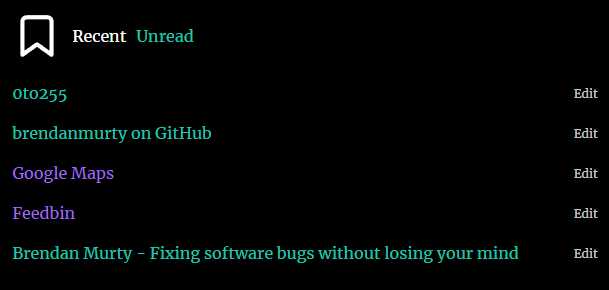

# Pinboard React Client

An alternative front-end for the [Pinboard](https://pinboard.in/) bookmarking service created with [React](https://reactjs.org/) and [Express](https://expressjs.com/).

The app also uses an icon from the [Feather](https://feathericons.com/) open-source icon pack.



## Directory Structure

- [assets](assets/) - Design-related source files
- [docs](docs/) - Project documentation files
- [docs/todo.md](docs/todo.md) - The project's task list
- [public](public/) - Front-end image and HTML files that are also used in the build process
- [src/api](src/api/) - Back-end API endpoint logic built using Express
- [src/css](src/css/) - Styling files for the UI
- [src/ui](src/ui/) - Front-end UI components built using React
- [src/index.js](src/index.js) - Front-end entry point used to initialise the UI via React
- [license.md](license.md) - The project's license file for details on the rights and limitations when using the code here in your own projects
- [package.json](package.json) - Node package configuration file that also includes shortcut commands in the `scripts` section
- [server.js](server.js) - Node web server that uses Express to configure routes for both the back-end and front-end

## Configuration

### Initial Setup

```
npm install
cp -n example.env .env
```

Then edit the `.env` file to use the appropriate configuration values for the application.

### Update the Pinboard API Token

1. Visit your [Pinboard password page](https://pinboard.in/settings/password)
2. Save this in `.env` as the value of the `PINBOARD_API_TOKEN` variable
3. Apply the changes to the application: `npm run serve`

### Update the domain and port configuration

1. Edit the `APP_DOMAIN` and `APP_PORT` values in `.env`
2. Apply the changes to the application: `npm run serve`

## Commands

### Compile a production-ready asset bundle

```
npm run build
```

### Start a local development server

```
npm run start
```

### Start the web server

```
npm run serve
```
